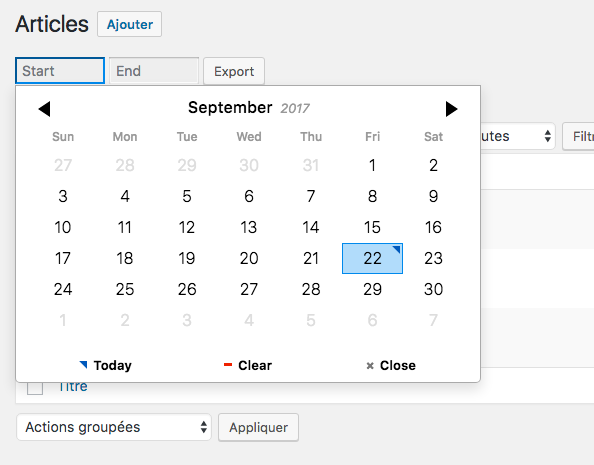

# Post Type Exporter

Wordpress Plugin for exporting a list of custom post type entries to a CSV or XLS file.

Support default and ACF Fields.



## Configuration

Plugin settings can only be changed using filters for the moment.

### Post Types

The plugin is only exporting posts by default. You need to use the `pte_post_types` filter to add / remove post types. Let's say you want to add the export feature to pages and a custom post type with slug `my-cpt` :

```php
function my_post_types( $post_types ){
    $post_types = array(
        "my-cpt" => array( // Post Type Slug
            "fields"        => array(
                'post_date'     => __('Date', 'wordpress'),
                'post_title'    => __('Title', 'wordpress')
            ),
            "fields_acf"    => array(
                'field_1'       => __('Field 1', 'my-text-domain'), 
                'field_2'       => __('Field 2', 'my-text-domain')
            )
        ),
        "page" => array(
            "fields"        => array(
                'post_date'     => __('Date', 'wordpress'),
                'post_title'    => __('Title', 'wordpress')
            ),
            "fields_acf"    => array(
                'field_A'       => __('Field A', 'my-text-domain'), 
                'field_B'       => __('Field B', 'my-text-domain')
            )
        )
    );
    
    return $post_types;
}
add_filter( 'pte_post_types', 'my_post_types' );
```

For each post type, array keys represents the fields to export, and array values represents the corresponding column title in the exported file.

### Export type

By default, the plugin is exporting xls file. But it is also possible to change this to csv using the `pte_export_type` filter : 

```php
function my_export_type( $type ){
    return 'csv';
}
add_filter( 'pte_export_type', 'my_export_type' );
```

Only `csv` and `xls` are supported values for the moment.